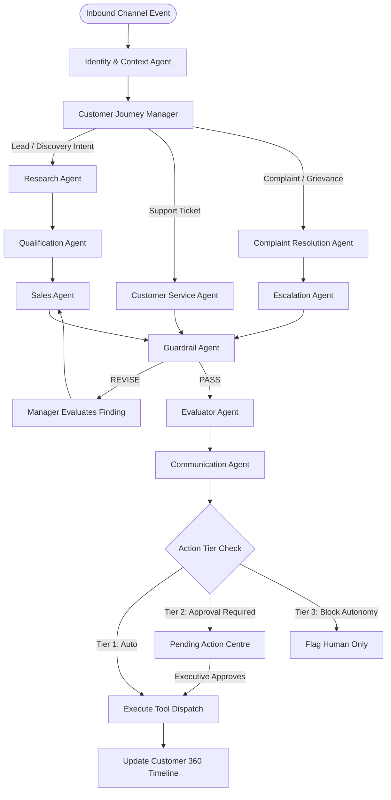

# RevenueAI 360

> **AI-Native Multi-Agent Customer Lifecycle Intelligence**  
> *Autonomous, continuous-context CRM & Lifecycle Orchestration across Email, WhatsApp, WebChat, and Internal Collaboration.*

[](https://github.com/MDXDXBHUB2026/RevenueAI-360/actions)
[](https://www.python.org/downloads/)
[](https://nextjs.org/)
[](https://fastapi.tiangolo.com)
[](https://langchain-ai.github.io/langgraph/)
[](https://github.com/pgvector/pgvector)

---

## 1. Executive Summary & Core Principle

**RevenueAI 360** is an enterprise-grade AI-native platform designed to maintain **ONE continuous customer context** regardless of communication channel. Rather than relying on fragile single-prompt chatbots or disconnected automation scripts, RevenueAI 360 couples **cooperating specialized AI agents** that reason over unified Customer 360 state with **deterministic, audited tools** that execute actions.

### Core Architectural Axiom:
> **Agents Decide. Tools Execute.**  
> Agents reason over validated context, synthesize intelligence, and produce structured intent. Deterministic tools execute state modifications, enforce Human-in-the-Loop (HITL) authorization tiers, and emit tamper-evident audit trails.

---

## 2. Capability Implementation Status

To ensure absolute transparency and auditability, every system capability is explicitly categorized below:

| Feature / Capability | Category | Implementation State | Verification / Location |
| :--- | :--- | :--- | :--- |
| **LangGraph Multi-Agent Orchestrator** | Core Engine | `[IMPLEMENTED]` | `agents/manager.py` (Conditional cyclic state machine) |
| **Identity & Context Resolution Agent** | Core Agent | `[IMPLEMENTED]` | `agents/identity_agent.py` (Deterministic channel identifier matching) |
| **Account Research Agent** | Core Agent | `[IMPLEMENTED]` | `agents/research_agent.py` & `tools/research_tools.py` |
| **Lead Qualification Agent** | Core Agent | `[IMPLEMENTED]` | `agents/qualification_agent.py` (Rule-backed classifications) |
| **Commercial Sales Agent** | Core Agent | `[IMPLEMENTED]` | `agents/sales_agent.py` (Discovery question synthesis) |
| **Customer Service Agent** | Core Agent | `[IMPLEMENTED]` | `agents/customer_service_agent.py` (RAG-grounded support resolution) |
| **Complaint Resolution Agent** | Core Agent | `[IMPLEMENTED]` | `agents/complaint_agent.py` (SLA & repeat grievance detection) |
| **Departmental Escalation Agent** | Core Agent | `[IMPLEMENTED]` | `agents/escalation_agent.py` (Tiered escalation routing) |
| **Channel Communication Agent** | Core Agent | `[IMPLEMENTED]` | `agents/communication_agent.py` (Channel tone normalization) |
| **Guardrail & Safety Agent** | Security & Governance | `[IMPLEMENTED]` | `agents/guardrail_agent.py` (PII, Prompt Injection, Unsupported Claims) |
| **Evaluator & Grounding Agent** | Quality Assurance | `[IMPLEMENTED]` | `agents/evaluator_agent.py` (Schema & citation completeness verification) |
| **Deterministic Tool Registry** | Integration Architecture | `[IMPLEMENTED]` | `tools/` (Typed inputs, outputs, permission tiers) |
| **Enterprise RAG Engine** | Retrieval System | `[IMPLEMENTED]` | `services/rag/` (Cosine similarity, chunking, citation retention) |
| **Next-Best-Action (NBA) Engine** | Intelligence Engine | `[IMPLEMENTED]` | `services/next_best_action.py` (Active complaint suppression logic) |
| **Customer AI Demo Builder** | Solution Engineering | `[IMPLEMENTED]` | `services/ai_demo_builder.py` & `/demo-builder` UI |
| **3-Tier Human-in-the-Loop Governance** | Enterprise Security | `[IMPLEMENTED]` | `Auto`, `Approval Required`, `Human Only / Block Autonomy` |
| **Next.js 15 Web Workspace** | User Interface | `[IMPLEMENTED]` | 12 interactive enterprise views (`apps/web`) |
| **AI Control Room & Live Telemetry** | Observability | `[IMPLEMENTED]` | Real-time stage inspection, state diffs, tool metrics |
| **In-Memory / SQLite Vector Fallback** | Local Resilience | `[IMPLEMENTED]` | Automatic fallback when PostgreSQL is unavailable |
| **PostgreSQL + pgvector** | Persistence | `[IMPLEMENTED]` | Full SQLAlchemy ORM models & Docker Compose setup |
| **Sandbox Channel Connectors (Email, WhatsApp, WebChat, Slack)** | Channel Gateways | `[DEMO CONNECTOR]` | `connectors/` & `apps/web/src/app/inbox/page.tsx` |
| **Direct SendGrid / Twilio Live Webhooks** | Channel Gateways | `[OPTIONAL INTEGRATION]` | Production adapter hooks documented in `connectors/` |
| **Direct Salesforce / HubSpot Bi-directional Sync** | External CRM | `[PLANNED]` | Domain interfaces prepared in `domain/models.py` |

---

## 3. Technology Stack

### Frontend Application (`apps/web`)
- **Framework**: Next.js 15 (App Router, Server & Client Components)
- **Language**: TypeScript 5.7+
- **Styling**: Tailwind CSS, Lucide React, Modern Dark Enterprise Theme
- **Data Fetching**: REST API Client with error handling and real-time polling hooks

### Backend Orchestration Service (`apps/api`)
- **Language**: Python 3.12+
- **API Framework**: FastAPI, Pydantic V2 (`BaseModel` validation)
- **Multi-Agent Runtime**: LangGraph 0.2+ (`StateGraph`, conditional cyclic routing)
- **Database ORM**: SQLAlchemy 2.0+ with `pgvector` extension
- **LLM Abstraction**: Pluggable provider adapter (`OpenAI`, `Anthropic`, `Gemini`, `Ollama`, `DeterministicDemoProvider`)

---

## 4. Multi-Agent Architecture & LangGraph Topology

RevenueAI 360 rejects static linear pipelines. Workflows execute dynamically based on incoming intent and live Customer 360 context:



---

## 5. Quickstart & Local Installation

### Prerequisites
- Python 3.12+
- Node.js 20+ and npm
- Docker & Docker Compose (Optional for containerized run)

### Step 1: Clone and Configure Environment
```bash
git clone https://github.com/MDXDXBHUB2026/RevenueAI-360.git
cd RevenueAI-360

# Copy environment template
cp .env.example .env
```

### Step 2: Backend Setup
```bash
# Create and activate virtual environment
python -m venv .venv
source .venv/bin/activate  # On Windows: .venv\Scripts\activate

# Install backend dependencies in editable mode
pip install -e ".[dev]"

# Launch FastAPI development server
uvicorn apps.api.main:app --host 127.0.0.1 --port 8000 --reload
```
The FastAPI swagger docs will be accessible at: `http://localhost:8000/docs`

### Step 3: Frontend Setup
```bash
cd apps/web
npm install
npm run dev
```
Open your browser to: `http://localhost:3000`

---

## 6. Running with Docker Compose

To run the complete production-grade topology with **PostgreSQL + pgvector**:
```bash
docker compose up --build -d
```
- Web Application: `http://localhost:3000`
- API Documentation: `http://localhost:8000/docs`
- PostgreSQL pgvector: `localhost:5434`

---

## 7. Automated Test Suite

RevenueAI 360 features a test suite verifying every branch of orchestration, governance, and REST surface:

```bash
# Run complete test suite
pytest -v
```

### Verified Test Scenarios:
1. `test_inbound_lead_vertical_slice`: End-to-end execution of lead qualification, discovery questions, RAG citation, guardrail validation, and HITL pending action.
2. `test_support_ticket_vertical_slice`: Customer context resolution, technical RAG retrieval, and grounded troubleshooting response generation.
3. `test_repeat_complaint_escalation_vertical_slice`: Detection of repeat SLA grievances, suppression of automated settlement, creation of high-priority internal engineering escalation.
4. `test_next_best_action_complaint_suppression`: Verifies that active complaints instantly suppress promotional sales outreach in favor of grievance resolution.
5. `test_guardrail_unsupported_claim_revision_cycle`: Simulates unsupported AI hallucination, triggers `REVISE` finding, and validates that revision successfully passes evaluation.
6. `test_ai_demo_builder_synthesis`: Generates tailored multi-agent architecture and phased prototype-to-production roadmap.
7. `test_api_endpoints`: Comprehensive REST integration tests covering ingestion, approvals, metrics, and trace telemetry.

---

## 8. Portfolio Demonstration Walkthrough (Fictional Entity: Nexa Logistics)

1. **Inbound Lead Ingestion**: Navigate to `/inbox` and dispatch an inbound email from *Marcus Vance (VP Logistics, Nexa Logistics)* inquiring about AI shipment tracking.
2. **Real-Time Control Room**: Open `/control-room` to observe the LangGraph state machine dynamically route through Identity, Manager, Research, Qualification, Knowledge, Sales, Guardrail, and Evaluator agents.
3. **Lead Intelligence**: Inspect `/leads` to review explainable qualification rationale, research evidence, and generated discovery questions.
4. **Human-in-the-Loop Approval**: Navigate to `/approvals` to review the synthesized draft response. Click **Approve & Execute** to trigger deterministic email dispatch tool.
5. **Cross-Channel Repeat Grievance**: Switch to WhatsApp channel in `/inbox` and submit a repeat delivery tracking failure message.
6. **Escalation & Next-Best-Action**: Observe the complaint resolution workflow escalate directly to Engineering and Customer Success, while `/customers` instantly suppresses commercial outreach.
7. **Customer AI Demo Builder**: Open `/demo-builder` to generate an enterprise solution blueprint proposing a specialized *Transit Exception Copilot* tailored for Nexa Logistics.

---

## 9. Security & Governance Standards

- **Strict Prompt Injection Isolation**: Retrieved knowledge documents and external channel payloads are treated as untrusted user data and enclosed in isolated delimiter zones.
- **Deterministic Permission Tiers**: 
  - **Tier 1 (Auto)**: Internal summarization, classification, read-only analytics.
  - **Tier 2 (Approval Required)**: Outbound emails, CRM deal updates, meeting scheduling.
  - **Tier 3 (Block Autonomy)**: Commercial refunds, binding legal contracts, service termination.
- **Zero Hallucination Grounding**: All factual assertions require verifiable chunk IDs and source document citations.

---

## 10. License & Attribution

Designed and engineered for enterprise portfolio demonstration as a reference implementation of **AI-Native Multi-Agent Orchestration & Enterprise Solutions Architecture**.
