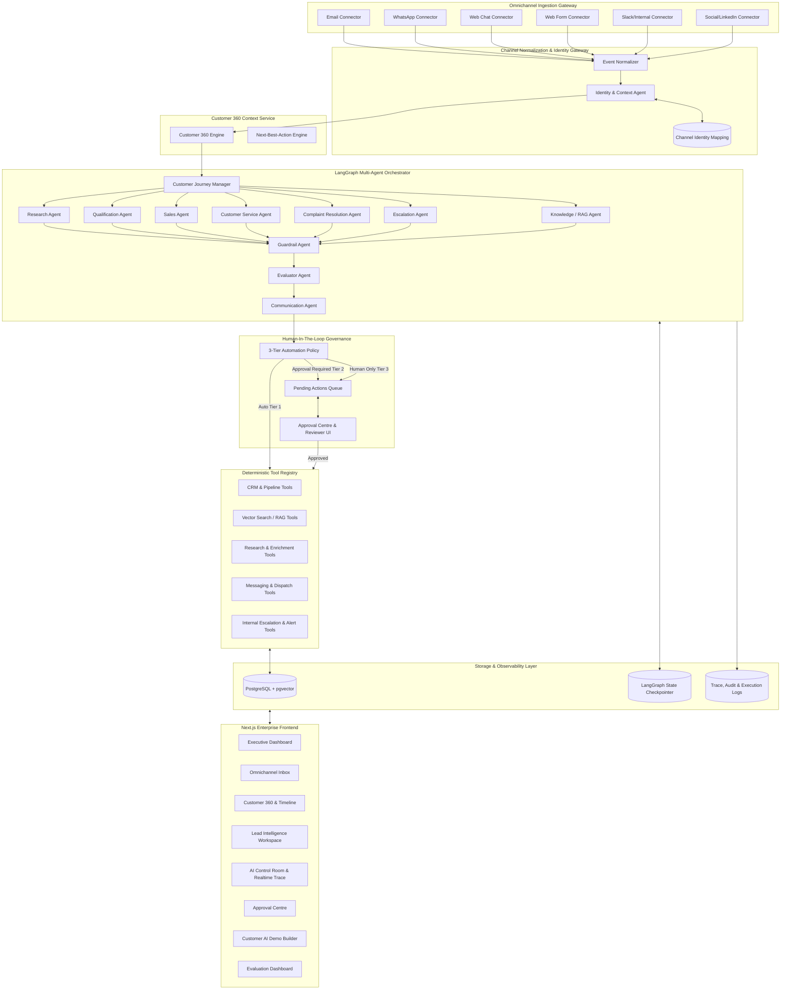
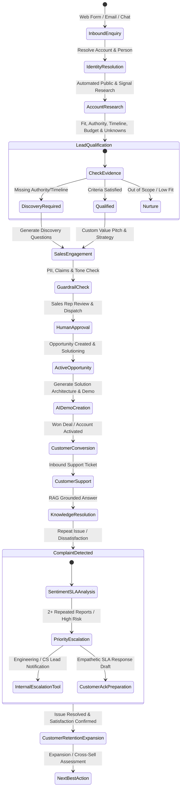
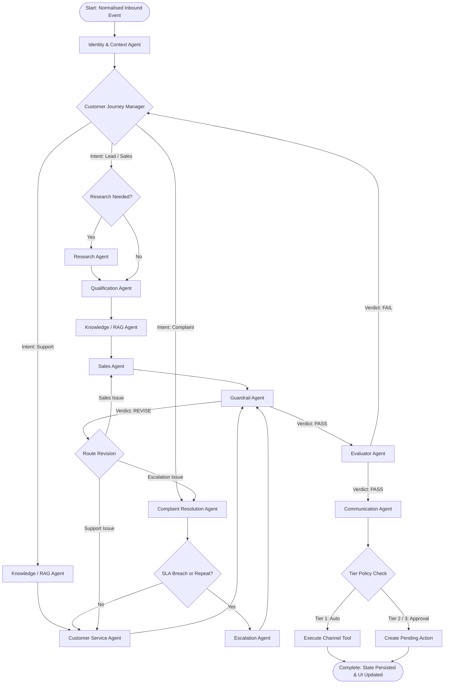
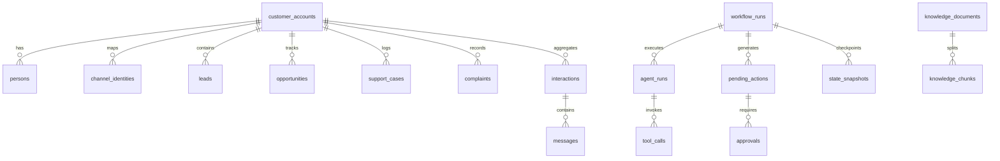

# RevenueAI 360: Architecture Proposal & System Specification

## 1. Executive Summary & Vision
**RevenueAI 360** is an AI-Native omnichannel Customer Lifecycle Intelligence platform engineered for high-stakes enterprise B2B customer relationships. Unlike conventional CRM systems that rely on static database forms, disconnected automated alerts, or chatbot overlays, RevenueAI 360 establishes **one continuous, unified Customer 360 context** spanning all digital touchpoints (Email, WhatsApp, Web Chat, Web Forms, Slack, Social/LinkedIn). 

The platform implements the core architectural axiom: **"Agents Decide, Tools Execute"**. Specialised AI agents operate under a centralized **Customer Journey Manager** powered by **LangGraph**, evaluating customer state, orchestrating deep research, conducting explainable qualification, drafting context-grounded commercial communications, diagnosing repeat complaints, and initiating human-in-the-loop approvals with full backend observability.

---

## 2. System Component Diagram



---

## 3. Customer Lifecycle Diagram

RevenueAI 360 models the complete end-to-end B2B customer journey with active context preservation:



---

## 4. Agent Architecture & Specialisation

| Agent Name | Primary Responsibility | Input Contract | Output Contract | Routing Preconditions |
| :--- | :--- | :--- | :--- | :--- |
| **Customer Journey Manager** | Master orchestrator of the state machine, conditional planner, iteration controller. | `SharedWorkflowState` | `ExecutionPlan`, next agent, termination condition | Always entry point after Identity Resolution |
| **Identity & Context Agent** | Normalises inbound payloads, queries `channel_identities`, links or creates contacts/accounts, hydrates Customer 360. | `NormalisedEvent` | `ResolvedIdentity`, `Customer360Context` | Inbound event received |
| **Research Agent** | Gathers domain profile, industry signals, tech stack, key initiatives using deterministic search tools. | `AccountName`, `Domain` | `AccountResearchResult`, `EvidenceProvenance[]` | New prospect or account missing enrichment |
| **Qualification Agent** | Evaluates B2B fit, intent, stakeholder authority, timeline, and discovery gaps. | `LeadData`, `ResearchResult`, `C360` | `QualificationStatus` (QUALIFIED, DISCOVERY_REQUIRED, etc.), `Unknowns[]`, `DiscoveryQuestions[]` | Inbound lead or discovery phase |
| **Sales Agent** | Crafts tailored commercial engagement, discovery strategy, and meeting agendas. | `C360`, `QualificationResult`, `KnowledgeSnippets` | `SalesStrategy`, `DraftOutreach`, `ValueHypothesis` | Sales objective active |
| **Customer Service Agent** | Resolves technical/operational queries using RAG and ticket history. | `C360`, `TicketDetails`, `RAGResults` | `SupportResolution`, `CitedSnippets[]`, `ActionItems[]` | Inbound support intent |
| **Complaint Resolution Agent** | Evaluates churn risk, repeated tickets, SLA violations, business impact. | `C360`, `ComplaintEvent`, `InteractionHistory` | `ComplaintAnalysis`, `UrgencyLevel`, `EscalationRequired` | Complaint intent detected or negative sentiment spike |
| **Knowledge / RAG Agent** | Semantic retrieval over policy documents, catalogues, case studies using pgvector. | `Query`, `FilterMetadata`, `TopK` | `RetrievedDocumentChunk[]`, `SimilarityScores` | Information lookup required |
| **Escalation Agent** | Determines destination department, internal urgency, and prepares internal incident briefing. | `ComplaintAnalysis` or `UnresolvedIssue` | `EscalationTarget`, `Priority`, `InternalBriefing` | Escalation flag set |
| **Communication Agent** | Formats approved business content for channel syntax (Email vs WhatsApp vs Slack). | `ApprovedDraft`, `ChannelType`, `Persona` | `FormattedMessage`, `ToneAnalysis` | Final response preparation |
| **Guardrail Agent** | Enforces safety, PII redaction, prompt injection defence, prevents unauthorized contractual commitments. | `AgentDraftOutput`, `Evidence` | `GuardrailVerdict` (PASS, REVISE, BLOCK), `Violations[]` | Prior to any customer-facing draft |
| **Evaluator Agent** | Measures citation coverage, grounding, schema validity, and policy adherence. | `StateSnapshot`, `AgentOutputs` | `EvaluationVerdict` (PASS, FAIL), `MetricScores`, `Feedback` | Pre-dispatch validation |

---

## 5. LangGraph Conditional Routing Design

The workflow graph avoids brittle linear chains. The **Customer Journey Manager** acts as the central router and conditional branch dispatcher:



---

## 6. Shared-State Schema (LangGraph State)

Implemented as a strictly typed Pydantic V2 model:

```python
class SharedWorkflowState(BaseModel):
    workflow_id: str
    trace_id: str
    event: NormalisedEvent
    customer_identity: Optional[ResolvedIdentity] = None
    customer360: Optional[Customer360Context] = None
    intent: Optional[str] = None  # lead, sales, support, complaint
    objective: Optional[str] = None
    execution_plan: List[str] = Field(default_factory=list)
    current_stage: str = "init"
    
    # Specialist agent structured outputs
    research_output: Optional[AccountResearchResult] = None
    qualification_output: Optional[QualificationResult] = None
    sales_output: Optional[SalesStrategyResult] = None
    service_output: Optional[ServiceResolutionResult] = None
    complaint_output: Optional[ComplaintResolutionResult] = None
    escalation_output: Optional[EscalationResult] = None
    
    # Evidence & RAG
    evidence: List[EvidenceItem] = Field(default_factory=list)
    citations: List[CitationItem] = Field(default_factory=list)
    unknowns: List[str] = Field(default_factory=list)
    risk_flags: List[str] = Field(default_factory=list)
    
    # Tool Execution Results
    tool_results: List[ToolResultRecord] = Field(default_factory=list)
    
    # Governance & Quality Checks
    guardrail_results: List[GuardrailResult] = Field(default_factory=list)
    evaluations: List[EvaluationResult] = Field(default_factory=list)
    pending_actions: List[PendingAction] = Field(default_factory=list)
    
    # Decisions & Final Dispatch
    next_best_action: Optional[NextBestActionResult] = None
    final_response: Optional[FormattedMessage] = None
    status: str = "running"  # running, waiting_approval, completed, failed
    errors: List[str] = Field(default_factory=list)
    iteration_count: int = 0
    created_at: datetime
    updated_at: datetime
```

---

## 7. Database Schema & pgvector Design

PostgreSQL 16 with the `vector` extension enabled.



### Table Definitions:
1. `customer_accounts`: id, name, domain, industry, tier, status (prospect, customer, churned), created_at.
2. `persons`: id, account_id, full_name, email, phone, role, title, created_at.
3. `channel_identities`: id, account_id, person_id, channel (email, whatsapp, webchat, etc.), external_id, verified.
4. `leads`: id, account_id, person_id, source, qualification_status, fit_score_category, notes, created_at.
5. `opportunities`: id, account_id, title, stage, value, close_date, ai_solution_concept, created_at.
6. `interactions`: id, account_id, person_id, channel, direction, subject, summary, sentiment, timestamp.
7. `messages`: id, interaction_id, sender_type (customer, agent, user), content, metadata.
8. `support_cases`: id, account_id, person_id, case_number, subject, description, status, priority, resolution.
9. `complaints`: id, account_id, person_id, case_id, severity, root_cause, sla_breached, status, escalation_target.
10. `tasks`: id, account_id, assigned_to, title, due_date, status.
11. `knowledge_documents`: id, title, doc_type, file_path, metadata, created_at.
12. `knowledge_chunks`: id, document_id, chunk_index, content, embedding vector(1536), metadata.
13. `workflow_runs`: id, trace_id, trigger_event, status, current_stage, created_at, finished_at.
14. `agent_runs`: id, workflow_id, agent_name, status, model_used, execution_rationale, input_state, output_state, duration_ms.
15. `tool_calls`: id, agent_run_id, tool_name, input_payload, output_payload, status, execution_ms.
16. `pending_actions`: id, workflow_id, action_type, risk_level, payload, status, reviewer_id, executed_at.
17. `approvals`: id, pending_action_id, reviewer, decision (approved, rejected, edited), comments, timestamp.
18. `audit_events`: id, entity_type, entity_id, action, actor, diff, timestamp.

---

## 8. Tool Registry Design ("Agents Decide, Tools Execute")

The Tool Registry guarantees that agents NEVER produce side-effects directly. All mutating operations occur through registered, schema-validated, audited tools:

```python
class ToolDefinition(BaseModel):
    name: str
    description: str
    input_schema: Type[BaseModel]
    output_schema: Type[BaseModel]
    side_effect: bool  # True if state mutating
    approval_required: bool  # Enforces Tier 2 HITL
    timeout_seconds: int = 30
    retry_policy: RetryPolicy
    permission_level: str  # read_only, standard, elevated, admin

class ToolRegistry:
    def register(self, tool: ToolDefinition, handler: Callable): ...
    async def execute(self, tool_name: str, payload: dict, context: ToolExecutionContext) -> ToolResult: ...
```

Registered Core Tools:
- CRM Queries: `get_customer360`, `get_interaction_history`, `get_open_cases`, `get_complaints`
- CRM Mutations: `create_lead`, `update_lead`, `create_opportunity`, `create_support_case`, `create_complaint`
- Vector Search: `search_knowledge_base`
- Public Research: `enrich_company_profile`
- Outbound Dispatch: `dispatch_email`, `dispatch_whatsapp`, `dispatch_slack_notification`
- Action Management: `enqueue_pending_action`, `record_audit_event`

---

## 9. Channel Connector Architecture

```python
class ChannelConnector(ABC):
    @abstractmethod
    async def receive_event(self, raw_payload: dict) -> NormalisedEvent: ...
    @abstractmethod
    async def send_message(self, message: FormattedMessage) -> DispatchResult: ...
    @abstractmethod
    async def validate_connection(self) -> bool: ...
```

Adapters:
- `DemoChannelConnector`: In-memory realistic sandbox for interactive demonstrations without external API keys.
- `EmailConnector`: IMAP/SMTP/SendGrid normalized channel.
- `WhatsAppConnector`: Meta Cloud API / Twilio normalized channel.
- `WebChatConnector`: Real-time WebSocket normalized channel.
- `SlackConnector`: Incoming Webhook & Bot API internal notification channel.
- `SocialMessagingConnector`: LinkedIn messaging simulation and webhook integration.

---

## 10. API Plan (FastAPI v1)

- `POST /api/v1/events/inbound` - Ingest external normalized channel event and trigger workflow.
- `GET /api/v1/customers` - List accounts with search and status filters.
- `GET /api/v1/customers/{id}/360` - Retrieve aggregated Customer 360 context and timeline.
- `POST /api/v1/leads/{id}/analyse` - Manually trigger AI lead intelligence analysis.
- `POST /api/v1/customers/{id}/support` - Ingest support request.
- `POST /api/v1/customers/{id}/complaints` - Ingest complaint and run escalation workflow.
- `POST /api/v1/customers/{id}/create-ai-demo` - Feature: Generate bespoke AI Solution Concept & Demo Architecture.
- `GET /api/v1/workflows/{id}` - Get workflow details, state, and outputs.
- `GET /api/v1/workflows/{id}/trace` - Get end-to-end execution trace (agents, tools, decisions).
- `GET /api/v1/workflows/events/stream` - SSE endpoint for live AI Control Room updates.
- `GET /api/v1/actions/pending` - List actions requiring human approval.
- `POST /api/v1/actions/{id}/approve` - Approve pending action and execute underlying tool.
- `POST /api/v1/actions/{id}/reject` - Reject pending action with feedback notes.
- `POST /api/v1/knowledge/documents` - Ingest PDF/TXT/MD document into pgvector.
- `GET /api/v1/evaluations/dashboard` - Retrieve evaluation benchmarks and quality metrics.

---

## 11. Frontend Information Architecture

Built with **Next.js (App Router)**, **React 19**, **TypeScript**, **Tailwind CSS**, and **shadcn/ui**:

1. **Executive Dashboard (`/`)**: KPI metrics (Active leads, Discovery required, Open Complaints, Pending Approvals, Guardrail Interventions), System Health, Live Activity Stream.
2. **Omnichannel Inbox (`/inbox`)**: Unified multi-channel inbound feed with channel badges, priority filtering, and instant trigger to AI analysis.
3. **Customer 360 & Timeline (`/customers/[id]`)**: Comprehensive account dossier, contact hierarchy, unified chronological interaction timeline, active complaints, sentiment trajectory, and Next Best Action card.
4. **Lead Intelligence Workspace (`/leads/[id]`)**: Deep research dossier, explainable qualification rubric, unknown discovery gaps, value proposition, and drafted engagement.
5. **AI Control Room (`/control-room`)**: Real-time LangGraph agent execution status, agent run cards, duration timers, model telemetry, structured outputs, evidence provenance, and conditional routing graph visualization.
6. **Workflow Trace (`/workflows/[id]/trace`)**: Detailed chronological execution log of every agent state transition, tool call parameters, guardrail outputs, and evaluator feedback.
7. **Approval Centre (`/approvals`)**: Governance dashboard with Tier 2 & Tier 3 pending actions, side-by-side payload inspection, risk classification, and One-Click Approve/Edit/Reject.
8. **Customer AI Demo Builder (`/demo-builder`)**: Rapid solution prototyping tool generating custom multi-agent architecture proposals, integration topology, and prototype-to-production roadmaps.
9. **Knowledge Base (`/knowledge`)**: RAG document manager, chunk viewer, semantic search tester, and vector embedding health.
10. **Evaluation Dashboard (`/evaluations`)**: Grounding accuracy, citation coverage, guardrail violation metrics, and routing fidelity telemetry.

---

## 12. First Vertical Slice Plan

The First Vertical Slice proves complete backend orchestration and end-to-end execution before proceeding to wider UI surfaces:

1. **Inbound Lead from Nexa Logistics** arrives via normalized DemoChannelConnector (`email`).
2. **Identity & Context Agent** resolves `Nexa Logistics` and contact `Marcus Vance (VP of Supply Chain Operations)`.
3. **Customer Journey Manager** plans `[Research, Qualification, Knowledge, Sales, Guardrail, Evaluator, Communication, PendingApproval]`.
4. **Research Agent** enriches Nexa Logistics (freight brokerage, fleet management, manual customer updates bottleneck).
5. **Qualification Agent** marks status as `DISCOVERY_REQUIRED` (identifies missing decision authority for IT budget and unknown deployment timeline; formulates 3 discovery questions).
6. **Knowledge Agent** fetches AI Customer Service Copilot capability and SLA documentation with citations.
7. **Sales Agent** crafts tailored discovery proposal and personalized outreach.
8. **Guardrail Agent** scans output for unsubstantiated claims and PII (returns `PASS`).
9. **Evaluator Agent** validates citation coverage and schema correctness (returns `PASS`).
10. **Communication Agent** adapts draft for professional Email tone.
11. **HITL Service** captures Tier 2 action `Send prospect email` in `pending_actions` queue.
12. **Audit & Trace Logging** persists full state snapshot, agent runs, tool calls, and evidence items.

---

## 13. Testing Strategy

1. **Unit Tests (`tests/unit/`)**:
   - Pydantic schema validation & serialization.
   - Provider abstraction interfaces & fallback handling.
   - Guardrail rule engines (PII, prompt injection, unsupported commercial claims).
   - Tool registry execution and permission policies.
2. **Integration Tests (`tests/integration/`)**:
   - Identity resolution with exact match and channel identity persistence.
   - RAG chunking, pgvector embedding, and cosine similarity retrieval with citations.
   - Channel connector normalization across email, whatsapp, webchat, slack.
3. **E2E Scenario Tests (`tests/e2e/`)**:
   - **Scenario 1**: Inbound lead → Research → Qualification → Sales Outreach → Guardrail → HITL Pending Action.
   - **Scenario 2**: Existing customer support query → Customer360 → RAG → Service response.
   - **Scenario 3**: Repeat complaint → SLA check → Escalation Agent → Internal Slack notification & customer acknowledgement.
   - **Scenario 4**: Guardrail failure trigger → Unsubstantiated promise → REVISE verdict → Sales agent revision → Evaluator PASS.

---

## 14. Technical Risk Register & Mitigations

| Risk | Impact | Likelihood | Mitigation Strategy |
| :--- | :--- | :--- | :--- |
| **LLM Provider API Outage / Rate Limits** | High | Medium | Pluggable `LLMProvider` abstraction with automatic local Ollama / Mock fallback mode. Never crash the app. |
| **Hallucination in Commercial Claims** | Critical | High | Strict RAG grounding requirement, Guardrail Agent regex & semantic checks, mandatory HITL Tier 2 approval for all outbound drafts. |
| **Identity Collision across Channels** | High | Medium | Strict deterministic identity resolution (email, phone, verified channel ID). No ungrounded probabilistic merge for sensitive data. |
| **Infinite Agent Revision Loops** | High | Low | Hardcoded `max_iterations = 2` in LangGraph Customer Journey Manager with fallback to human review if unresolved. |
| **PostgreSQL Port Collisions** | Medium | Medium | Docker Compose mapped to custom external port `5434` with isolated volume storage. SQLite fallback for offline unit test suites. |
