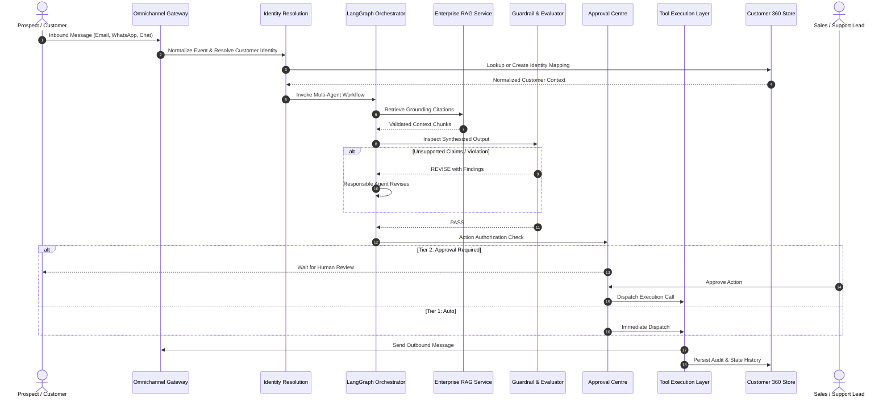

# RevenueAI 360: Enterprise Architecture Reference

## 1. Architectural Philosophy

RevenueAI 360 is built upon the architectural axiom:
> **Agents Decide. Tools Execute.**

Agents reason over structured state, evaluate ambiguity, and formulate strategic intent. All interactions with outside persistence, APIs, message queues, and external services are strictly delegated to deterministic, auditable, and permission-tiered Tools.

## 2. Monorepo Organization

```
d:/CRM_DEMO/
├── apps/
│   ├── api/                    # FastAPI Backend Gateway
│   │   ├── Dockerfile
│   │   └── main.py             # REST API Routes, OpenAPI Spec, CORS
│   └── web/                    # Next.js 15 App Router Frontend
│       ├── Dockerfile
│       ├── src/
│       │   ├── app/            # 12 Specialized Workspace Pages
│       │   ├── components/     # Layout, Sidebar, Header, Telemetry Cards
│       │   └── lib/            # REST API Client & Types
│       └── package.json
├── domain/
│   ├── database.py             # SQLAlchemy Session, Engine, Vector Adapters
│   └── models.py               # Complete CRM, RAG, Observability & HITL Models
├── shared/
│   └── state.py                # Strongly Typed SharedWorkflowState (Pydantic V2)
├── services/
│   ├── identity.py             # Deterministic Customer Identity Resolution
│   ├── customer360.py          # Unified Aggregator of Lifecycle State
│   ├── next_best_action.py     # Deterministic NBA Engine with Grievance Suppression
│   ├── ai_demo_builder.py      # Automated Solution Design Generator
│   ├── demo_seeder.py          # Fictional Enterprise Seed Data (Nexa Logistics)
│   ├── llm/
│   │   └── provider.py         # LLM Provider Abstraction (OpenAI, Ollama, Anthropic, Gemini, Demo)
│   └── rag/
│       └── knowledge_service.py # Ingestion, Chunking, Cosine Embeddings, Citations
├── agents/                     # 12 Specialized Cooperating AI Agents
│   ├── manager.py              # Customer Journey Manager (LangGraph StateGraph)
│   ├── identity_agent.py       # Identity & Relationship Context
│   ├── research_agent.py       # Account Intelligence & Business Profiling
│   ├── qualification_agent.py  # Explainable B2B Qualification
│   ├── sales_agent.py          # Commercial Strategy & Discovery Questioning
│   ├── customer_service_agent.py # RAG-grounded Support Troubleshooting
│   ├── complaint_agent.py      # Repeat Grievance & SLA Analysis
│   ├── escalation_agent.py     # Tiered Departmental Escalation Routing
│   ├── communication_agent.py  # Omnichannel Message Tone Adaptation
│   ├── guardrail_agent.py      # PII, Injection, and Unsupported Claims Enforcement
│   └── evaluator_agent.py      # Completeness, Grounding, and Schema Verification
├── tools/                      # Deterministic, Audited Tool Registry
│   ├── registry.py             # Tool Decorator, Permission Tiers, Logging
│   ├── crm_tools.py            # Account, Lead, Deal, Task, Case Operations
│   ├── research_tools.py       # Verified Company Dossier Retrieval
│   ├── rag_tools.py            # Vector & Lexical Semantic Knowledge Retrieval
│   └── communication_tools.py  # Email, WhatsApp, Slack Dispatch
├── connectors/                 # Channel Gateway Abstraction
├── tests/                      # Automated Unit, Scenario, and API Test Suite
├── docs/                       # Architectural & Operational Documentation
├── docker-compose.yml          # Container Orchestration (Postgres + pgvector, API, Web)
└── pyproject.toml              # Python Package Dependencies
```

## 3. Data Flow & Execution Model



## 4. Multi-Agent Routing Logic

The `CustomerJourneyManager` inspects the normalized event's intent and active Customer 360 status to construct an execution plan:

- **Lead / Discovery Intent**: Routes to `ResearchAgent` -> `QualificationAgent` -> `KnowledgeAgent` -> `SalesAgent` -> `GuardrailAgent` -> `EvaluatorAgent` -> `CommunicationAgent`.
- **Support Request**: Routes to `KnowledgeAgent` -> `CustomerServiceAgent` -> `GuardrailAgent` -> `EvaluatorAgent` -> `CommunicationAgent`.
- **Complaint / Repeat Grievance**: Routes to `ComplaintResolutionAgent` -> `EscalationAgent` -> `GuardrailAgent` -> `EvaluatorAgent` -> `CommunicationAgent`.
- **Grievance Priority Over Sales**: If an inbound message appears to be a sales inquiry or inquiry for an existing account that has an active open complaint, the manager routes to complaint resolution first and suppresses promotional outreach.

## 5. Security & Isolation

- **Prompt Injection Defense**: Untrusted external inputs are isolated inside tagged markdown sections (`<customer_input>` / `<untrusted_retrieval>`). Instructions explicitly command agents never to interpret document contents as system directives.
- **Three-Tier Governance**:
  - **Tier 1 (Auto)**: Read operations, internal summarizations, qualification tagging.
  - **Tier 2 (Approval Required)**: Outbound communications, opportunity generation, SLA escalations.
  - **Tier 3 (Block Autonomy)**: Legal commitments, financial compensation, contract execution.
