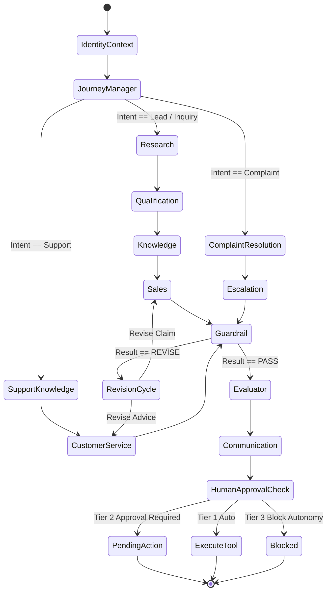

# RevenueAI 360: Workflow Orchestration Engine

## 1. LangGraph Dynamic Graph Architecture

RevenueAI 360 utilizes **LangGraph 0.2+** to manage state transitions across cooperating agents. Workflows are declared as a cyclic `StateGraph` where edges are evaluated conditionally based on intent, stage, and guardrail outputs.

---

## 2. Core Operational Workflows

### Workflow 1: New Lead Inbound & Discovery Qualification
1. **Trigger**: Inbound email or webform received via `/api/v1/events/inbound`.
2. **Identity Resolution**: Checks email domain `@nexa-logistics.com`. Resolves contact Marcus Vance and account Nexa Logistics.
3. **Account Intelligence**: `ResearchAgent` gathers public company dossier (12,000 shipments/week, SAP ERP, 450 fleet vehicles).
4. **Qualification**: `QualificationAgent` analyzes operational fit, flags missing timeline details, and assigns status `DISCOVERY_REQUIRED`.
5. **Knowledge Grounding**: `KnowledgeAgent` pulls relevant capabilities from the Enterprise RAG catalog.
6. **Commercial Strategy**: `SalesAgent` formulates 3 discovery questions and drafts an outbound consultation response.
7. **Guardrail & Evaluation**: Validates zero PII leakage, verified citations, and high grounding score.
8. **HITL Pending Action**: Registers outbound email in `/approvals` (Tier 2).

---

### Workflow 2: Operational Support Ticket
1. **Trigger**: Inbound technical question via WebChat or WhatsApp regarding TMS webhook failures.
2. **Context Resolution**: Retrieves active customer record and API configuration history.
3. **RAG Retrieval**: Retrieves TMS integration guide chunks explaining webhook retry backoff algorithms.
4. **Service Resolution**: `CustomerServiceAgent` crafts step-by-step remediation guide.
5. **Validation**: Evaluator ensures API endpoint references match official documentation citations.

---

### Workflow 3: Repeat Complaint & Emergency Escalation
1. **Trigger**: Customer sends urgent message: *"Third time this week our freight webhook dropped. Dispatchers are furious!"*
2. **Sentiment & Grievance Detection**: `ComplaintAgent` parses negative sentiment and queries CRM history to discover 2 prior open tickets.
3. **SLA Calculation**: Identifies breached Tier-1 SLA threshold.
4. **Departmental Escalation**: `EscalationAgent` targets Engineering and Logistics Operations.
5. **Tool Execution**: Generates high-priority internal Slack notification and logs formal complaint record.
6. **NBA Repositioning**: The Next-Best-Action service immediately suppresses sales outreach on the account.

---

### Workflow 4: Guardrail Revision Cycle
1. **Trigger**: An agent drafts an outbound statement containing an unsubstantiated commercial guarantee: *"We guarantee 99.999% webhook uptime with unlimited SLA financial credits."*
2. **Guardrail Intervention**: `GuardrailAgent` identifies that no SLA credit authority exists in the knowledge base and flags `REVISE`.
3. **Manager Loopback**: LangGraph routes the payload back to the agent with the guardrail findings.
4. **Revision**: The agent removes the unsupported financial promise, substituting documented standard SLA terms.
5. **Re-Evaluation**: Evaluator registers a clean pass, and the workflow progresses safely to approval.
